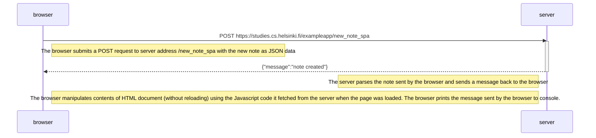

```mermaid
sequenceDiagram
    participant browser
    participant server

    browser->>server: POST https://studies.cs.helsinki.fi/exampleapp/new_note_spa
    activate server

    Note right of browser: The browser submits a POST request to server address /new_note_spa with the new note as JSON data

    server-->>browser: {"message":"note created"}
    deactivate server

    Note left of server: The server parses the note sent by the browser and sends a message back to the browser

    Note right of browser: The browser manipulates contents of HTML document (without reloading) using the Javascript code it fetched from the server when the page was loaded. The browser prints the message sent by the browser to console.
```